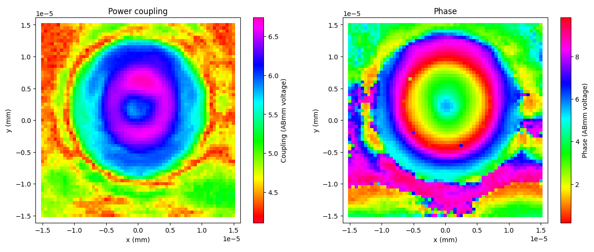
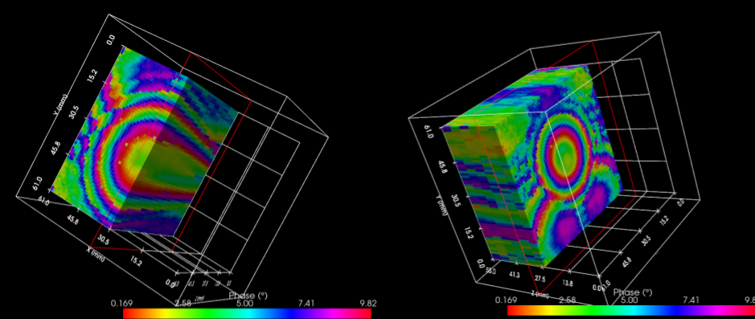
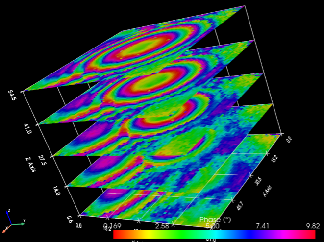
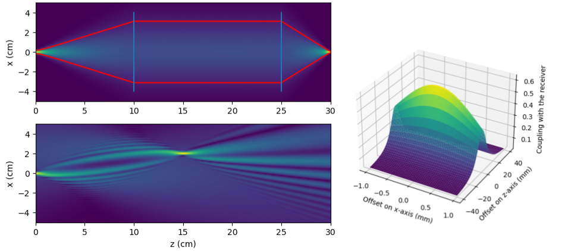
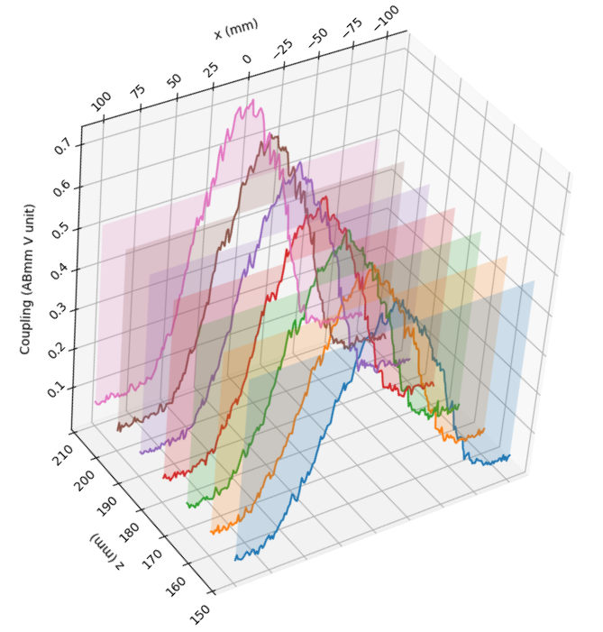

# gaussian-optics
2 month internship at the LERMA team of the Observatoire de Paris

## Install
python 3.9
```bash
pip install -r requirements.txt
```

# Measurements Signal Processing

Make sure to read first the 

# 3D field measurements vizualisation

The provided script can help you vizualise the 3D measurements of both phase and amplitude measurements of ABmm. The resulting csv file should look like this:
```csv
	x (m)	y (m)	Mesure ch1 (V)	Mesure ch2 (V)
0	-5.2500e-02	-5.2500e-02	 4.6334e+00	 2.4428e+00
1	-5.0750e-02	-5.2500e-02	 4.7498e+00	 3.4530e+00
2	-4.9000e-02	-5.2500e-02	 4.6741e+00	 4.3458e+00
3	-4.7250e-02	-5.2500e-02	 4.5226e+00	 5.9272e+00
4	-4.5500e-02	-5.2500e-02	 4.2688e+00	 5.9266e+00
5	-4.3750e-02	-5.2500e-02	 4.3560e+00	 5.1008e+00
```

You can find in the [example script](./volumetric_measurements_viz\examples.py).
## Plane Sweep Measurements Viz

```python
data = Rectangular_sweep_data("banc_1.2/xy_x0_7905_y0_24716_z0_300_step_05_60_x_60")
data.plot()
```


## Volumetric Sweep Measurements Viz

data = Volumetric_sweep_data('banc_1.2\scan_nuit')

```python
data = Volumetric_sweep_data('banc_1.2\scan_nuit')
```

```python
data.plot_mri_mode(channel=2, on_axis='x')
data.plot_mri_mode(channel=2)
```



```python
data.plot_slices_mode(channel=2, n_slices=5)
```




# 2D Gaussian Beam Simulation




This script can help you design a simple optical bench with lenses and Gaussian Beams.

Follow the [tutorial here](./beam_propagation/beam_propagation_tutorial.ipynb)


# 2D Waist Regression

Get the beam wait $\omega_0$ from a set of transversal linear sweep measurements at different $z$ distances.

Find the [example script here](./waist_regression/mesure_waist.py).

